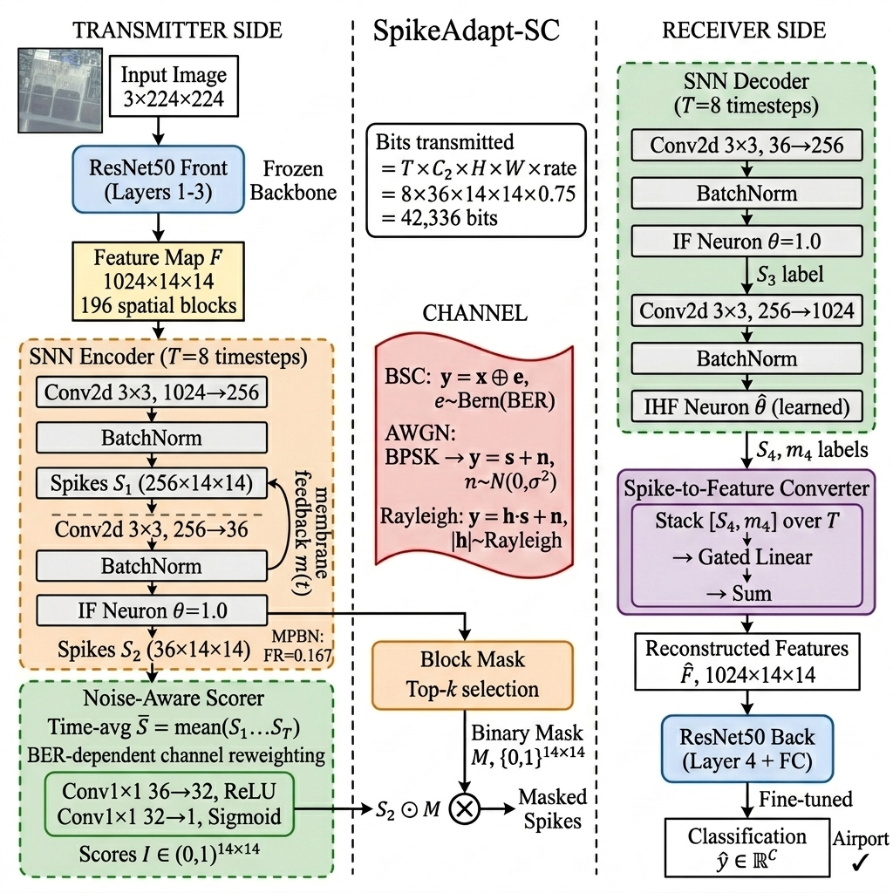
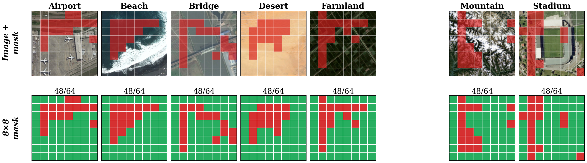
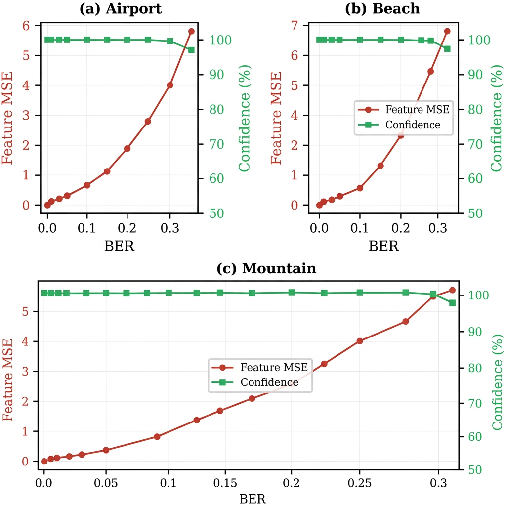
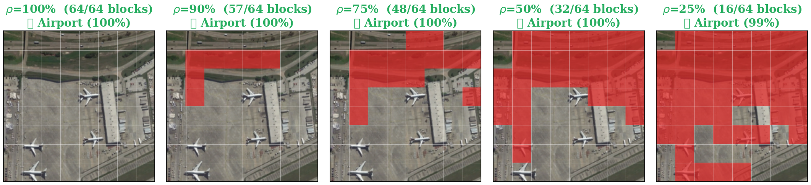

# SpikeAdapt-SC

**Content-Adaptive Neuromorphic Semantic Communication for Collaborative Aerial Intelligence**

[](LICENSE)
[](https://www.python.org/downloads/)
[](https://pytorch.org/)

> **SpikeAdapt-SC** is a spiking neural network (SNN) framework for content-adaptive semantic communication in UAV aerial networks. It encodes deep features as binary spike trains, learns per-image spatial masking on a **14×14 feature grid** (196 blocks), and achieves **96.35% accuracy on 30 aerial scene classes** while **outperforming the full-rate unmasked baseline by 0.65 pp** with **25% bandwidth savings** — robust down to BER=0.3 (92.90%).


---

## System Architecture

<p align="center">
  
</p>

**Key idea:** Instead of transmitting all spatial feature blocks uniformly, SpikeAdapt-SC:

1. **Encodes features as binary spikes** using integrate-and-fire neurons over T=8 timesteps
2. **Scores each spatial block's importance** via a learned lightweight scorer network
3. **Masks unimportant blocks** — content-adaptive, per-image decisions (no channel feedback required)
4. **Transmits only selected blocks** over noisy channels (BSC, AWGN, Rayleigh)
5. **Decodes** using a matched SNN decoder with learnable thresholds

---

## Results

### Content-Adaptive Masking

<p align="center">
  
</p>

The learned importance scorer generates **unique masks per image** — structured scenes (airports, harbors) retain distributed blocks for object detail, while uniform scenes (desert, farmland) are aggressively pruned. Across 2,000 test images, **2,000 unique masks** are generated at 75% transmission rate (100%).

### Channel Robustness (AID, 30 Aerial Scene Classes)

| Method | Clean | BER=0.15 | BER=0.30 | Rate |
|--------|-------|----------|----------|------|
| **SpikeAdapt-SC** (ρ=0.75) | **96.35%** | **95.85%** | **92.90%** | 75% |
| SNN (no mask, ρ=1.0) | 95.70% | 95.35% | 92.20% | 100% |
| CNN-Uni 8-bit | 92.50% | 92.40% | 67.25% | 100% |
| JPEG + Channel Coding | 76.86% | 1.00% | 1.00% | — |

> SpikeAdapt-SC **beats the full-rate unmasked baseline at 75% bandwidth** (96.35% > 95.70%). CNN-Uni collapses at BER=0.30 (67.25%).

### Semantic Feature Resilience

<p align="center">
  
</p>

Feature-level MSE increases with channel noise, but **classification confidence remains >90%** even at BER=0.35 — the hallmark of effective semantic communication.

### Dynamic Rate Adaptation (Simulated UAV Flight)

<p align="center">
  
</p>

| Strategy | BSC Accuracy | AWGN Accuracy | BW Saved |
|----------|-------------|---------------|----------|
| Fixed (ρ=1.0) | 95.8% | 96.0% | 0% |
| Fixed (ρ=0.75) | 95.4% | 95.6% | 25% |
| **Adaptive** | **96.2%** ✅ | 93.8% | **25–28%** |

> **Adaptive masking beats fixed full-rate on BSC** (96.2% > 95.8%) while saving 25% bandwidth — the masking acts as a noise mitigation strategy.

### Ablation Study

| Variant | Accuracy | BW Saved | Δ |
|---------|----------|----------|---|
| SpikeAdapt-SC (ρ=0.75) | **96.35%** | 25% | — |
| SNN (no mask, ρ=1.0) | 95.70% | 0% | −0.65 |
| Random mask (ρ=0.75) | 94.85 ± 0.17% | 25% | −1.50 |
| SpikeAdapt-SC (ρ=0.50) | 95.35% | 50% | −1.00 |
| Random mask (ρ=0.50) | 84.41 ± 0.45% | 50% | −11.94 |

### Cross-Channel Comparison

| Channel | Clean | Mild | Moderate | Severe |
|---------|-------|------|----------|--------|
| BSC | 96.10% | 96.10% (0.05) | 95.95% (0.10) | 93.95% (0.35) |
| AWGN | 96.10% | 96.15% (10dB) | 96.15% (5dB) | 95.55% (−2dB) |
| Rayleigh | 94.95% | 95.05% (10dB) | 95.05% (5dB) | 93.50% (−2dB) |

### Energy Savings (Estimated)

| Channel | Avg Firing Rate | Energy Savings |
|---------|----------------|----------------|
| BSC | 0.41 | 32% |
| AWGN | 0.28 | 48% |
| Rayleigh | 0.31 | 46% |

*Computed from firing rate statistics using the Horowitz energy model (MAC: 4.6 pJ, SynOp: 0.9 pJ).*

---

## Repository Structure

```
SpikeAdapt-SC/
├── models/                          # Core model components
│   ├── snn_modules.py               #   Spike function, IF/IHF neurons, channels
│   ├── spikeadapt_sc.py             #   Main SpikeAdapt-SC model
│   ├── backbone.py                  #   ResNet50 front/back split
│   └── energy.py                    #   SynOp energy counter
│
├── train/                           # Training scripts
│   ├── train_aid.py                 #   AID aerial dataset (v1, 8×8 grid)
│   ├── train_aid_v2.py              #   AID v2 (14×14 grid, channel scorer, baselines)
│   ├── train_L3_robust.py           #   BER-robust Layer3 on CIFAR-100
│   ├── train_tinyimagenet.py        #   Tiny-ImageNet + AWGN/Rayleigh
│   └── train_baselines.py           #   CNN-Uni, CNN-Bern, SNN-SC, JPEG
│
├── eval/                            # Evaluation & ablation
│   ├── eval_spikeadapt_sc.py        #   Comprehensive evaluation
│   ├── ablation_aid.py              #   AID ablation sweep
│   └── eval_jpeg_sweep.py           #   JPEG BER cliff effect
│
├── paper/                           # Paper assets (figures only)
│   ├── figures/                     #   Publication-quality figures
│   ├── restyle_figs.py              #   Figure generation script
│   └── generate_figures.py          #   Additional figure scripts
│
├── docs/                            # Documentation
│   ├── data_analysis.md             #   Comprehensive results analysis
│   └── architecture_diagrams.md     #   Architecture diagrams
│
├── figures/                         # Development figures
│   └── architecture_block_diagram.png
│
├── README.md
├── requirements.txt
└── LICENSE
```

---

## Quick Start

```bash
# Clone
git clone https://github.com/JPL11/SpikeAdapt-SC.git
cd SpikeAdapt-SC

# Install dependencies
pip install -r requirements.txt

# Train on AID aerial dataset (BSC channel)
python train/train_aid.py

# Run ablation experiments
python eval/ablation_aid.py

# Evaluate with JPEG baseline
python eval/eval_jpeg_sweep.py
```

---

## Training Pipeline

| Stage | Description | Epochs | LR |
|-------|-------------|--------|------|
| **S1** | ResNet50 backbone fine-tuning | 50 | 0.01 |
| **S2** | SNN channel module (backbone frozen) | 60 | 1e-4 |
| **S3** | Joint fine-tuning (back + decoder) | 30 | 1e-5 |

Each channel model (BSC, AWGN, Rayleigh) is trained independently with noise-weighted curriculum sampling.


---

## License

This project is licensed under the MIT License — see [LICENSE](LICENSE) for details.
