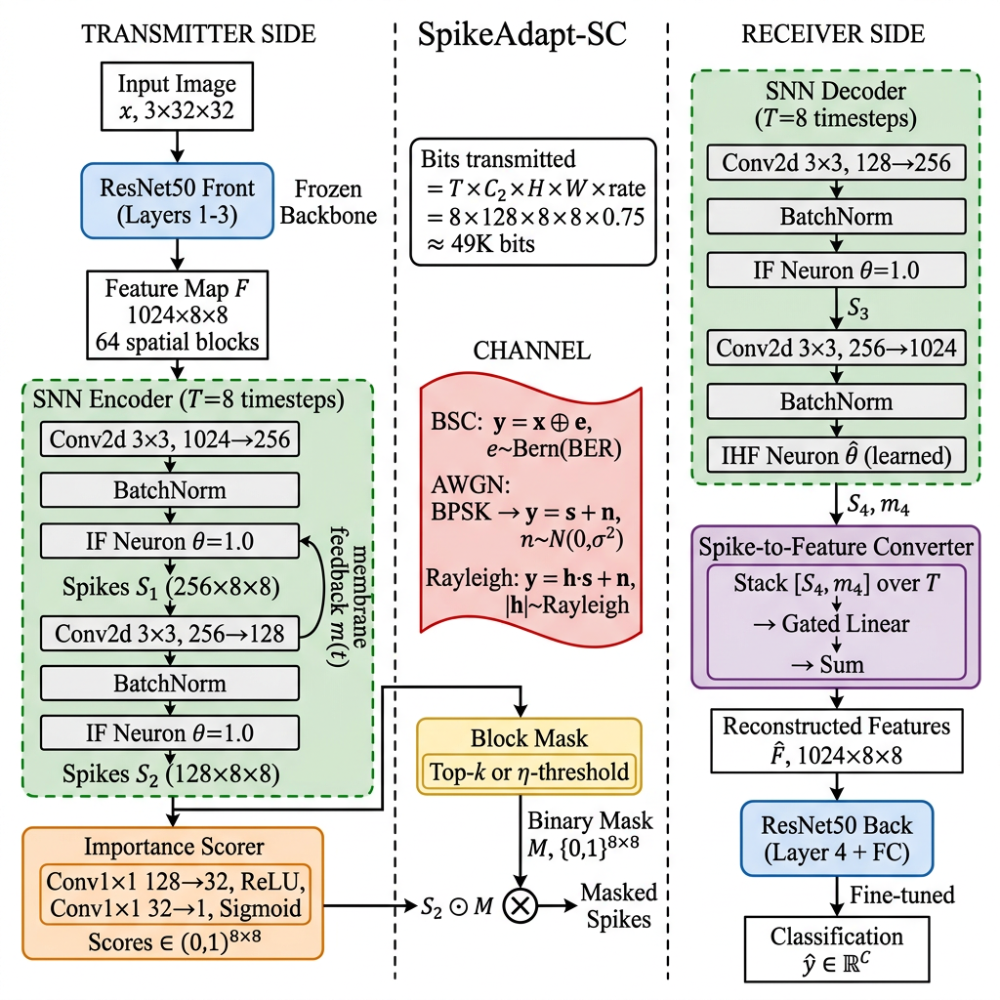

# SpikeAdapt-SC

**Content-Adaptive Bandwidth Allocation for SNN-Based Semantic Communication**

[](LICENSE)
[](https://www.python.org/downloads/)
[](https://pytorch.org/)

> SpikeAdapt-SC uses spiking neural networks with learned spatial masking to achieve content-adaptive bandwidth allocation over noisy channels. It provides graceful degradation under channel impairments while saving 25–50% bandwidth with minimal accuracy loss.

---

## Architecture



**Key idea:** Instead of transmitting all spatial feature blocks uniformly, SpikeAdapt-SC:

1. **Encodes features as binary spikes** using integrate-and-fire neurons over T timesteps
2. **Scores each spatial block's importance** via a learned lightweight network
3. **Masks unimportant blocks** — content-adaptive, per-image decisions
4. **Transmits only selected blocks** over noisy channels (BSC, AWGN, Rayleigh)
5. **Decodes** using a matched SNN decoder with learnable thresholds

```
Input → [ResNet50 L1-L3] → Features (1024×8×8) → [SNN Encoder ×T]
    → Spike Trains → [Importance Scorer] → [Block Mask]
    → Masked Spikes → [Channel] → [SNN Decoder ×T]
    → [Spike-to-Feature Converter] → [ResNet50 L4+FC] → Classification
```

---

## Results

### Channel Robustness

**CIFAR-100 (BSC Channel)**

| Method | BER=0 | BER=0.1 | BER=0.3 | BW Saved |
|--------|-------|---------|---------|----------|
| **SpikeAdapt-SC (Ours)** | **75.05%** | **75.21%** | **72.27%** | **~18%** |
| SNN-SC T=8 | 75.78% | 75.52% | 71.79% | 0% |
| CNN-Bern | 75.51% | 74.95% | 70.12% | 0% |
| CNN-Uniform | 29.80% | 1.00% | 1.00% | 0% |

**Tiny-ImageNet (Multi-Channel)**

| Channel | Clean | Mid-Noise | High-Noise | Energy Savings |
|---------|-------|-----------|------------|---------------|
| BSC | 59.30% | 61.49% (BER=0.15) | 53.36% (BER=0.3) | **32%** |
| AWGN | 62.33% | 62.33% (SNR=5dB) | 58.60% (SNR=-2dB) | **48%** |
| Rayleigh | 61.35% | 61.88% (SNR=7dB) | 56.87% (SNR=-2dB) | **46%** |

### Adaptive Bandwidth

| Tx Rate | CIFAR-100 | Δ | Tiny-ImageNet (AWGN) | Δ |
|---------|-----------|---|---------------------|---|
| 100% | 74.68% | — | 61.82% | — |
| 75% | 74.68% | **0.00%** | **62.29%** | **+0.47%** |
| 50% | 73.83% | -0.85% | 60.45% | -1.37% |

> At 75% rate, accuracy is equal or better than 100%. Masking removes noise-vulnerable blocks.

### Content Adaptation

| Grid | Unique Masks (out of 10K) | Approach |
|------|--------------------------|----------|
| 4×4 (Layer4) | 2 | ❌ Static mask |
| 8×8 (Layer3) | 2,478 | ✅ Entropy-based |
| 8×8 (Learned) | **8,987** | ✅ Near-perfect per-image |

---

## Repository Structure

```
SpikeAdapt-SC/
├── models/                          # Core model components
│   ├── snn_modules.py               #   Spike function, IF/IHF neurons, channels
│   ├── spikeadapt_sc.py             #   Main SpikeAdapt-SC model
│   ├── backbone.py                  #   ResNet50 front/back split
│   └── energy.py                    #   SynOp energy counter
│
├── train/                           # Training scripts
│   ├── train_L3_robust.py           #   Best model: BER-robust Layer3
│   ├── train_tinyimagenet.py        #   Tiny-ImageNet + AWGN/Rayleigh
│   ├── train_tinyimagenet_pooled.py #   Tiny-ImageNet with 8×8 pooling
│   ├── train_baselines.py           #   CNN-Uni, CNN-Bern, SNN-SC, JPEG
│   ├── train_spikeadapt_sc.py       #   Original SpikeAdapt-SC (Layer4)
│   ├── train_layer3_split.py        #   Layer3 split (8×8 grid)
│   ├── train_learned_importance.py  #   Learned importance scorer
│   ├── train_robust_learned.py      #   BER-robust + learned importance
│   ├── train_ablation_ce_only.py    #   CE-only ablation (Layer4)
│   └── train_ablation_L3_ce_only.py #   CE-only ablation (Layer3)
│
├── eval/                            # Evaluation
│   └── eval_spikeadapt_sc.py        #   Comprehensive evaluation script
│
├── docs/                            # Documentation
│   ├── data_analysis.md             #   Comprehensive results analysis
│   ├── architecture_diagrams.md     #   Detailed Mermaid diagrams
│   └── spikeadapt_sc_architecture.md#   Architecture specification
│
├── baselines/                       # Baseline reproductions
│   ├── SNN_SC_replication_Class.ipynb#   SNN-SC classification baseline
│   └── SNN_SC_replication_Seg.ipynb #   SNN-SC segmentation baseline
│
├── scripts/                         # Development utilities
│   ├── diagnose_entropy.py          #   Entropy diagnostic (Layer4)
│   ├── diagnose_entropy_L3.py       #   Entropy diagnostic (Layer3)
│   ├── architecture_audit_and_fixes.py
│   └── RUNME_GUIDE.py
│
├── figures/                         # Generated figures
│   └── architecture_block_diagram.png
│
├── README.md
├── requirements.txt
└── LICENSE
```

---

## Quick Start

```bash
# Clone
git clone https://github.com/JPL11/SpikeAdapt-SC.git
cd SpikeAdapt-SC

# Install dependencies
pip install -r requirements.txt

# Train best model (BER-robust Layer3 on CIFAR-100)
python train/train_L3_robust.py

# Train on Tiny-ImageNet with AWGN/Rayleigh channels
python train/train_tinyimagenet.py

# Train baselines for comparison
python train/train_baselines.py
```

---

## Training Pipeline

| Stage | Description | Epochs | LR |
|-------|-------------|--------|------|
| **S1** | ResNet50 backbone | 100 | 0.1 |
| **S2** | SNN channel module (backbone frozen) | 60 | 1e-4 |
| **S3** | Joint fine-tuning (back + decoder) | 40 | 1e-5 |

**BER-robust training:** Noise sampled with 50% weight on high-noise region (BER ∈ [0.15, 0.4] or SNR ∈ [-2, 5] dB).

---

## Key Findings

| # | Finding |
|---|---------|
| 1 | SNN encoding provides natural channel robustness — AWGN accuracy flat from SNR=20 to 0 dB |
| 2 | Content-adaptive masking requires 8×8+ spatial grid (4×4 produces static masks) |
| 3 | 50% bandwidth savings costs <1% accuracy on CIFAR-100 |
| 4 | Masking can *improve* accuracy — AWGN at 75% rate beats 100% rate |
| 5 | 32–48% energy savings vs equivalent ANN (SynOp vs MAC) |
| 6 | BER-weighted training recovers +2.95% at BER=0.3 |

---

## Ablation Summary

| Ablation | Finding |
|----------|---------|
| 4×4 vs 8×8 grid | 4×4 produces 2 static masks; 8×8 enables 2,478+ unique masks |
| CE-only vs full loss | Entropy loss hurts on 4×4 (−2.1%), neutral on 8×8 (±0.1%) |
| Uniform vs weighted BER | Weighted: +0.55% clean, +2.95% at BER=0.3 |
| Entropy vs learned scorer | Learned: 4× more masks; Entropy: better BER robustness |
| 16×16 vs pooled 8×8 | 16×16 wins by 5–8% on Tiny-ImageNet across all channels |

See [docs/data_analysis.md](docs/data_analysis.md) for the full analysis with all experiment results.

---

## Citation

```bibtex
@inproceedings{spikeadaptsc2026,
  title     = {SpikeAdapt-SC: Content-Adaptive Bandwidth Allocation 
               for SNN-Based Semantic Communication},
  booktitle = {IEEE Global Communications Conference (GLOBECOM)},
  year      = {2026}
}
```

## License

This project is licensed under the MIT License — see [LICENSE](LICENSE) for details.
