# SpikeAdapt-SC: Content-Adaptive Bandwidth Allocation for SNN-Based Semantic Communication

> **SpikeAdapt-SC** uses spiking neural networks with learned spatial masking to achieve adaptive bandwidth allocation over noisy channels, providing graceful degradation under channel impairments while saving 25–50% bandwidth with minimal accuracy loss.

---

## Architecture

```mermaid
graph LR
    subgraph TX["📡 Transmitter"]
        A["🖼️ Image"] --> B["ResNet50<br/>Layers 1-3"]
        B --> C["Features<br/>1024×8×8"]
        C --> D["⚡ SNN Encoder<br/>IF Neurons × T"]
        D --> E["Spike Trains<br/>128×8×8 × T"]
        E --> F["🎯 Importance<br/>Scorer"]
        F --> G["Block Mask<br/>M ∈ {0,1}⁸ˣ⁸"]
        G --> H["Masked Spikes"]
    end

    H --> I["📻 Channel<br/>BSC/AWGN/Rayleigh"]

    subgraph RX["📱 Receiver"]
        I --> J["⚡ SNN Decoder<br/>IHF Neurons × T"]
        J --> K["Feature<br/>Reconstruction"]
        K --> L["ResNet50<br/>Layer 4 + FC"]
        L --> M["📊 Classification"]
    end
```



### Key Idea

Instead of transmitting all spatial blocks uniformly, SpikeAdapt-SC:
1. **Encodes features as binary spikes** using integrate-and-fire neurons
2. **Scores each spatial block's importance** via a learned lightweight network  
3. **Masks unimportant blocks** to save bandwidth — content-adaptive, per-image
4. **Transmits only kept blocks** over noisy channels (BSC, AWGN, Rayleigh)
5. **Decodes** using a matched SNN decoder with learnable thresholds

---

## Results

### CIFAR-100 — BER Robustness (BSC Channel)

| Method | BER=0 | BER=0.1 | BER=0.3 | BW Saved |
|--------|-------|---------|---------|----------|
| **SpikeAdapt-SC (Ours)** | **75.05%** | **75.21%** | **72.27%** | **~18%** |
| SNN-SC T=8 | 75.78% | 75.52% | 71.79% | 0% |
| CNN-Bern | 75.51% | 74.95% | 70.12% | 0% |
| CNN-Uniform | 29.80% | 1.00% | 1.00% | 0% |

> SNN methods degrade gracefully; CNN/JPEG show **cliff effects** at high BER.

### Adaptive Bandwidth — "Send Less, Lose Almost Nothing"

| Tx Rate | CIFAR-100 | Δ | Tiny-ImageNet (AWGN) | Δ |
|---------|-----------|---|---------------------|---|
| 100% | 74.68% | — | 61.82% | — |
| 75% | 74.68% | **0.00%** | **62.29%** | **+0.47%** |
| 50% | 73.83% | -0.85% | 60.45% | -1.37% |
| 25% | 68.43% | -6.25% | 27.33% | — |

> At 75% rate, accuracy is **equal or better** than 100%. Masking removes noisy blocks!

### Tiny-ImageNet — Multi-Channel Comparison

| Channel | Clean | Mid-noise | High-noise | Energy Savings |
|---------|-------|-----------|------------|---------------|
| BSC | 59.30% | 61.49% (BER=0.15) | 53.36% (BER=0.3) | **32%** |
| AWGN | 62.33% | 62.33% (SNR=5dB) | 58.60% (SNR=-2dB) | **48%** |
| Rayleigh | 61.35% | 61.88% (SNR=7dB) | 56.87% (SNR=-2dB) | **46%** |

### Content Adaptation

| Spatial Grid | Unique Masks | Approach |
|-------------|-------------|----------|
| 4×4 (Layer4) | 2 | ❌ Static — same mask for all images |
| 8×8 (Layer3) | 2,478 | ✅ Entropy-based adaptation |
| 8×8 (Learned) | **8,987** | ✅ Near-perfect per-image masking |

### Energy Efficiency

| Component | SNN (SynOps) | ANN (MACs) | SNN Energy | ANN Energy | **Savings** |
|-----------|-------------|-----------|-----------|-----------|------------|
| SC Module | 409–537B | 155B | 0.9 pJ/op | 4.6 pJ/op | **32–48%** |

*Energy model: Horowitz 2014 (45nm CMOS)*

---

## Architecture Details

```
Input Image (3×32×32 or 3×64×64)
    │
    ▼
┌─────────────────────────────┐
│  ResNet50 Front (L1→L2→L3) │  ← Frozen backbone
│  Output: 1024 × H × W      │
└─────────────┬───────────────┘
              │
    ┌─────────▼─────────┐
    │   SNN Encoder      │  × T timesteps
    │   Conv 1024→256    │
    │   IF Neuron (θ=1)  │
    │   Conv 256→128     │─── Spike Trains S₂
    │   IF Neuron (θ=1)  │    {0,1}^(128×H×W)
    └─────────┬─────────┘
              │
    ┌─────────▼─────────────────┐
    │  Importance Scorer         │
    │  Conv1×1: 128→32→1        │─── Scores ∈ (0,1)^(H×W)
    │  + Sigmoid                 │
    └─────────┬─────────────────┘
              │
    ┌─────────▼─────────┐
    │  Block Mask        │
    │  Top-k or η-thresh │─── Binary Mask M
    │  Gumbel-sigmoid    │    {0,1}^(H×W)
    └─────────┬─────────┘
              │
     S₂ ⊙ M ─┤  (masked spikes)
              │
    ══════════╪══════════════════  Channel
    BSC:      │  flip bits with prob=BER
    AWGN:     │  BPSK + N(0,σ²) + hard decision
    Rayleigh: │  BPSK × h + N(0,σ²), h~Rayleigh
    ══════════╪══════════════════
              │
    ┌─────────▼─────────┐
    │   SNN Decoder      │  × T timesteps
    │   Conv 128→256     │
    │   IF Neuron (θ=1)  │
    │   Conv 256→1024    │
    │   IHF Neuron (θ̂)   │─── θ̂ is learned!
    └─────────┬─────────┘
              │
    ┌─────────▼──────────────────┐
    │  Spike-to-Feature Converter │
    │  Stack [spikes, membranes]  │
    │  Gated linear combination   │
    └─────────┬──────────────────┘
              │
    ┌─────────▼─────────────────┐
    │  ResNet50 Back (L4→FC)    │  ← Fine-tuned
    │  Output: num_classes      │
    └───────────────────────────┘
```

---

## Training

### Three-Stage Pipeline

| Stage | What | Epochs | LR | Frozen |
|-------|------|--------|------|--------|
| **S1** | Backbone (ResNet50) | 100 | 0.1 | — |
| **S2** | SNN Channel Module | 60 | 1e-4 | Front + Back |
| **S3** | Joint Fine-tuning | 40 | 1e-5 | Front only |

### BER-Robust Training
- **Noise range**: BER ∈ [0, 0.4] or SNR ∈ [-2, 20] dB
- **Weighted sampling**: 50% from high-noise region
- **Loss**: CrossEntropy + λ · |Tx_rate − target|

---

## Repository Structure

```
SemCom/
├── train_spikeadapt_sc.py          # Main SpikeAdapt-SC (Layer4, 4×4)
├── train_layer3_split.py            # Layer3 split (8×8 grid)
├── train_L3_robust.py               # BER-robust L3 (best CIFAR-100)
├── train_learned_importance.py      # Learned importance scorer
├── train_robust_learned.py          # BER-robust + learned importance
├── train_baselines.py               # CNN-Uni, CNN-Bern, SNN-SC, JPEG
├── train_tinyimagenet.py            # Tiny-ImageNet + BSC/AWGN/Rayleigh
├── train_tinyimagenet_pooled.py     # Tiny-ImageNet with 8×8 pooling
├── train_ablation_ce_only.py        # CE-only ablation (Layer4)
├── train_ablation_L3_ce_only.py     # CE-only ablation (Layer3)
├── diagnose_entropy.py              # Entropy diagnostic (Layer4)
├── diagnose_entropy_L3.py           # Entropy diagnostic (Layer3)
├── eval_spikeadapt_sc.py            # Evaluation scripts
├── data_analysis.md                 # Comprehensive results analysis
├── architecture_diagrams.md         # Architecture diagrams (Mermaid)
└── spikeadapt_sc_architecture.md    # Architecture specification
```

---

## Quick Start

```bash
# 1. Set up environment
conda create -n semcom python=3.10
conda activate semcom
pip install torch torchvision tqdm matplotlib scipy

# 2. Train backbone + baselines
python train_baselines.py

# 3. Train SpikeAdapt-SC (BER-robust, Layer3)
python train_L3_robust.py

# 4. Train on Tiny-ImageNet with AWGN/Rayleigh
python train_tinyimagenet.py

# 5. View results
cat data_analysis.md
```

---

## Key Findings

| # | Finding |
|---|---------|
| 1 | **SNN encoding provides natural channel robustness** — AWGN accuracy flat from SNR=20 to SNR=0 dB |
| 2 | **Content-adaptive masking works on 8×8 grids** — 8,987 unique masks out of 10,000 images |
| 3 | **50% bandwidth savings costs <1% accuracy** on CIFAR-100 |
| 4 | **Masking can improve accuracy** — AWGN at 75% rate beats 100% rate |
| 5 | **32–48% energy savings** vs equivalent ANN architecture |
| 6 | **BER-weighted training** recovers +2.95% at BER=0.3 |

---

## Ablation Summary

| Ablation | Finding |
|----------|---------|
| 4×4 vs 8×8 grid | 4×4 produces static masks (2 unique). 8×8 enables real adaptation |
| CE-only vs Full loss | Entropy loss hurts on 4×4 (-2.07%), neutral on 8×8 (±0.1%) |
| Uniform vs weighted BER | Weighted training: +0.55% clean, +2.95% at BER=0.3 |
| Entropy vs Learned scorer | Learned: 4× more unique masks. Entropy: better BER robustness |

---

## Citation

```bibtex
@inproceedings{spikeadaptsc2026,
  title     = {SpikeAdapt-SC: Content-Adaptive Bandwidth Allocation 
               for SNN-Based Semantic Communication},
  author    = {},
  booktitle = {IEEE Global Communications Conference (GLOBECOM)},
  year      = {2026}
}
```

---

## License

MIT
