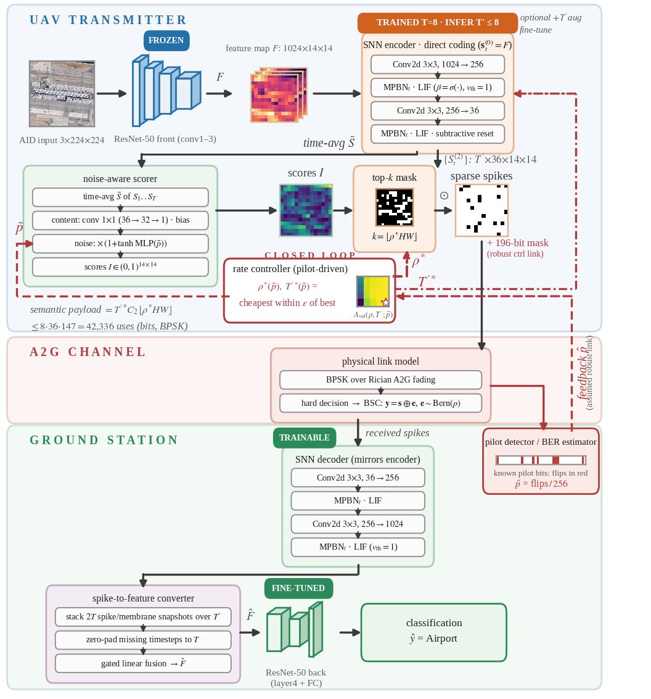

# SpikeAdapt-SC

[](LICENSE)
[](https://www.python.org/)
[](https://pytorch.org/)

**Adaptive spiking semantic communication for aerial platforms**: task-oriented
transport of visual features and radar array features over modeled UAV
air-to-ground (A2G) channels, with training-free rate adaptation (spatial
masking ρ × temporal truncation T′) driven in closed loop by a pilot-based
BER estimate.

<p align="center">
  
</p>

A frozen backbone feeds a spiking bottleneck whose binary spike maps cross a
hard-decision BSC derived from a BPSK/Rician A2G link. A ground-side pilot
estimator feeds the error rate back; a validation-selected lookup controller
picks the cheapest (ρ, T′) operating point meeting an accuracy tolerance.
All policies are selected on validation surfaces and scored once on test.

## Papers

This repository accompanies two papers by Jacky Li (California State
Polytechnic University, Pomona), both currently under review:

1. **Adaptive spiking semantic communication for robust and efficient aerial
   visual inference** — visual track: AID / NWPU-RESISC45 classification,
   DOTA detection, segmentation, reconstruction.
2. **Task-oriented spiking transport of radar features over UAV air-to-ground
   links** — radar/array track: RADIal detection + free-space segmentation
   over FFTRadNet features, DoA transport with CRB / Ziv–Zakai anchors.

Full citations will replace this notice upon publication; until then please
cite the repository (see [Citation](#citation)).

## Quickstart: reproduce paper statistics (no GPU needed)

All result JSONs are committed, so paper-level tables and statistics
regenerate directly from the artifacts:

```bash
conda create -n semcom python=3.10 && conda activate semcom
pip install -r requirements.txt

# Radar paper, Table 2 (physical-receiver closed-loop mission, 3 seeds):
python eval/radial_table2_stats.py \
    --grid eval/seed_results/radial_ylink_grid_valtest.json
# -> joint  0.947+/-0.022  0.884+/-0.052  0.914+/-0.020  48.7% ...

# Radar paper, Figures 2-3:
python eval/plot_array_icassp_figs.py --ylink
```

The full number → script → artifact map for **every** reported value in both
papers is in [`REPRODUCING.md`](REPRODUCING.md). Re-running the grids and
training from scratch requires the datasets and GPUs (scripts and seeds
included; see below).

## Layout

| Path | Contents |
|---|---|
| `train/` | Encoder/decoder/codec training (spiking bottlenecks, fair 1-bit controls, BER curriculum) |
| `eval/` | Evaluation, channel modeling, closed-loop missions, plotting |
| `eval/seed_results/` | JSON artifacts backing every reported number |
| `models/` | Spiking modules (LIF encoder/decoder, noise-aware scorer, masking) |
| `patches/` | Modifications to the third-party FFTRadNet repo (`patches/README.md`) |
| `datasets/` | Dataset download/preparation scripts |
| `docs/` | Architecture figure |

## Full setup (training / re-evaluation)

Datasets: AID, NWPU-RESISC45, DOTA (visual track); RADIal (radar track —
`datasets/` contains the download helper; ~140 GB). The RADIal baseline uses
the official [FFTRadNet](https://github.com/valeoai/RADIal) code with the
changes captured in `patches/` — clone it as `radial_repo/FFTRadNet` and
apply the diff. Evaluation protocols, seeds (42/123/456 for 3-seed rows),
and leakage rules (validation-selected policies, test scored once) are
documented in `REPRODUCING.md`.

## Citation

```bibtex
@misc{li2026spikeadaptsc,
  author       = {Li, Jacky},
  title        = {SpikeAdapt-SC: Adaptive Spiking Semantic Communication
                  for Aerial Platforms},
  year         = {2026},
  howpublished = {\url{https://github.com/JPL11/SpikeAdapt-SC}},
  note         = {Code and result artifacts for two manuscripts under review}
}
```

## Contact

Jacky Li — jpli@cpp.edu — California State Polytechnic University, Pomona

## License

MIT (see [`LICENSE`](LICENSE)). The `patches/` directory documents changes to
third-party code (FFTRadNet), which retains its own license.
