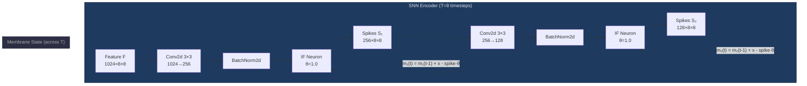
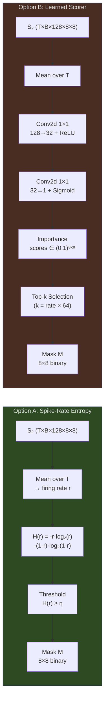
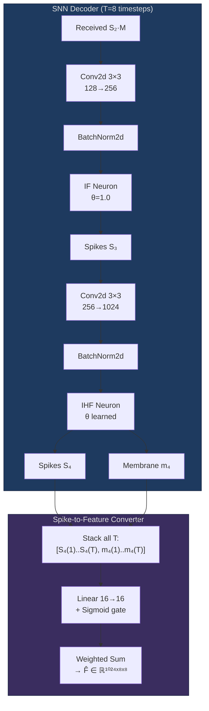
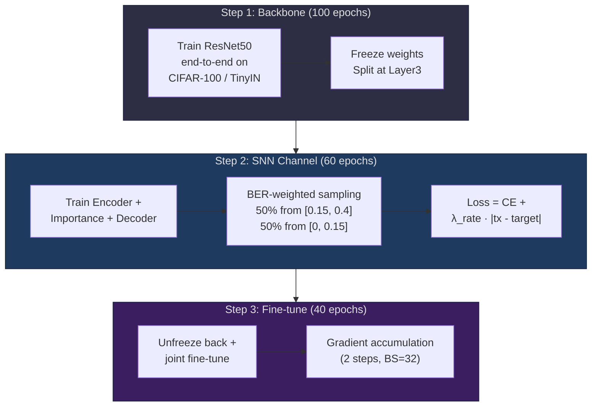
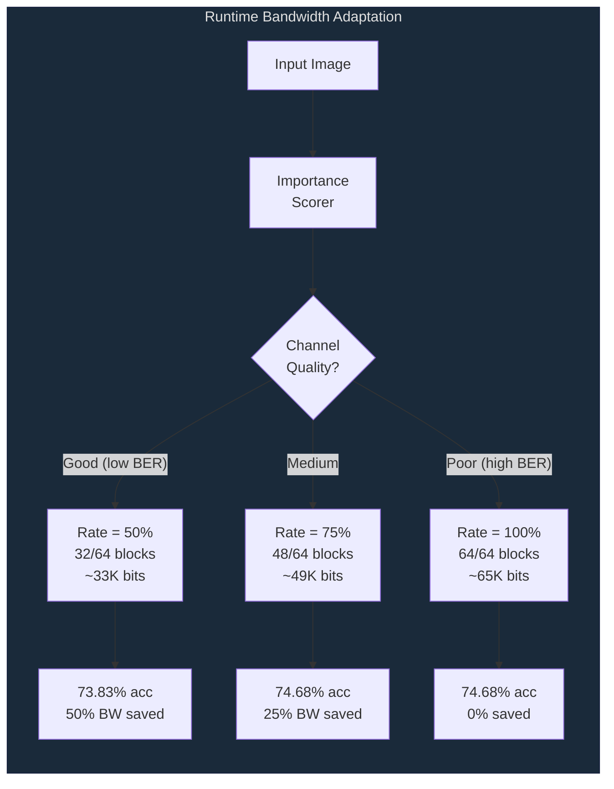

# SpikeAdapt-SC: System Architecture

## System Block Diagram

```mermaid
graph LR
    subgraph TX["Transmitter"]
        A["Input Image<br/>x ∈ ℝ³ˣ³²ˣ³²"] --> B["ResNet50<br/>Front<br/>(Layers 1-3)"]
        B --> C["Feature Map<br/>F ∈ ℝ¹⁰²⁴ˣ⁸ˣ⁸"]
        C --> D["SNN Encoder<br/>(IF Neurons)"]
        D --> E["Spike Trains<br/>S₂ ∈ {0,1}<br/>T×128×8×8"]
        E --> F["Importance<br/>Scorer"]
        F --> G["Block Mask<br/>M ∈ {0,1}⁸ˣ⁸"]
        G --> H["Masked Spikes<br/>S₂ ⊙ M"]
    end

    subgraph CH["Channel"]
        H --> I["BSC / AWGN /<br/>Rayleigh"]
        I --> J["Received<br/>Spikes"]
    end

    subgraph RX["Receiver"]
        J --> K["SNN Decoder<br/>(IHF Neurons)"]
        K --> L["Reconstructed<br/>Features F̂"]
        L --> M["ResNet50<br/>Back<br/>(Layer 4)"]
        M --> N["Classification<br/>ŷ ∈ ℝ²⁰⁰"]
    end

    style TX fill:#1a1a2e,color:#e0e0e0,stroke:#16213e
    style CH fill:#0f3460,color:#e0e0e0,stroke:#16213e
    style RX fill:#1a1a2e,color:#e0e0e0,stroke:#16213e
```



---

## Detailed Encoder Architecture



---

## Importance Scoring & Masking



---

## Decoder Architecture



---

## Channel Models

```mermaid
graph TD
    subgraph CHANNELS["Physical Channel Models"]
        direction TB
        subgraph BSC["BSC (Binary Symmetric)"]
            B1["x ∈ {0,1}"] --> B2["Flip with<br/>prob = BER"]
            B2 --> B3["y = x ⊕ flip"]
        end
        subgraph AWGN["AWGN"]
            A1["x ∈ {0,1}"] --> A2["BPSK: s = 2x-1"]
            A2 --> A3["y = s + n<br/>n ~ N(0, σ²)"]
            A3 --> A4["Hard decision<br/>x̂ = (y>0)"]
        end
        subgraph RAY["Rayleigh Fading"]
            R1["x ∈ {0,1}"] --> R2["BPSK: s = 2x-1"]
            R2 --> R3["y = h·s + n<br/>|h| ~ Rayleigh"]
            R3 --> R4["Equalize: y/|h|"]
            R4 --> R5["Hard decision"]
        end
    end

    style BSC fill:#2d3a22,color:#e0e0e0,stroke:#16213e
    style AWGN fill:#3a2d22,color:#e0e0e0,stroke:#16213e
    style RAY fill:#22293a,color:#e0e0e0,stroke:#16213e
```



---

## Training Pipeline



---

## Adaptive Bandwidth Control



---

## Tensor Dimensions Through the Pipeline

```
Input:          (B, 3, 32, 32)     — RGB image
                        ↓ ResNet Front (L1→L2→L3)
Features:       (B, 1024, 8, 8)    — 64 spatial blocks
                        ↓ SNN Encoder (×T timesteps)
Spikes:         (T, B, 128, 8, 8)  — binary spike trains
                        ↓ Importance Scorer
Importance:     (B, 8, 8)          — per-block scores
                        ↓ Block Mask (top-k or threshold)
Mask:           (B, 1, 8, 8)       — binary mask
                        ↓ Mask × Spikes
Masked:         (T, B, 128, 8, 8)  — masked spikes → CHANNEL
                        ↓ BSC / AWGN / Rayleigh
Received:       (T, B, 128, 8, 8)  — noisy spikes
                        ↓ SNN Decoder + Converter
Reconstructed:  (B, 1024, 8, 8)    — recovered features
                        ↓ ResNet Back (L4→FC)
Output:         (B, num_classes)    — classification logits
```

**Bits transmitted** = `T × C₂ × H × W × mask_rate` = `8 × 128 × 8 × 8 × 0.75` ≈ **49,152 bits**
